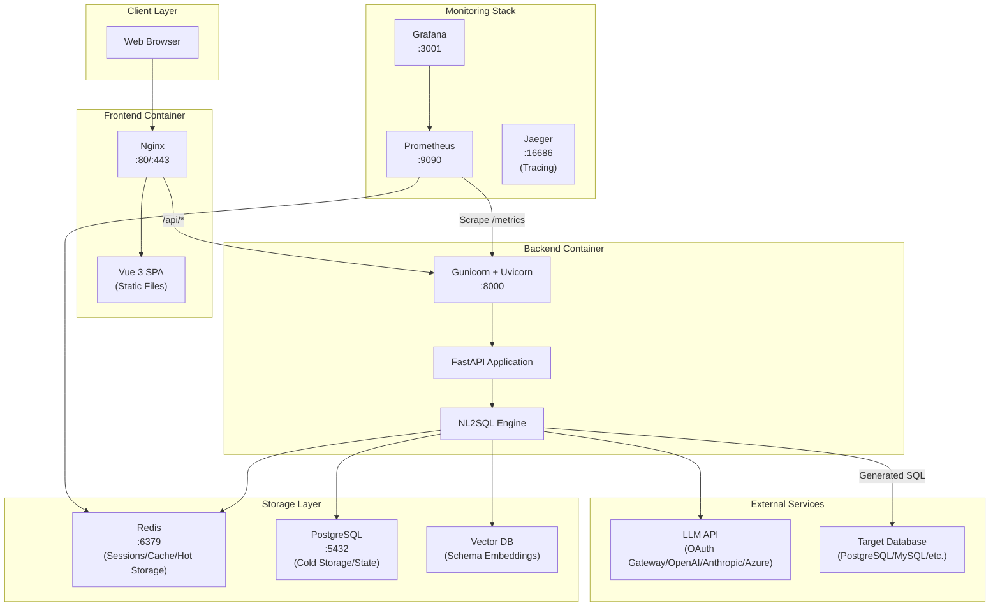
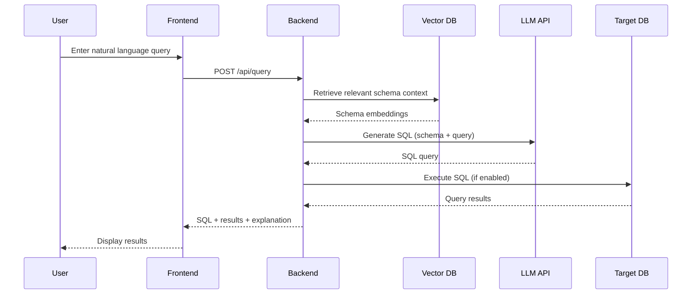

# QueryfyAI Operations Runbook

## Table of Contents
- [Overview](#overview)
- [Architecture](#architecture)
- [Deployment](#deployment)
- [Configuration](#configuration)
- [Operations](#operations)
- [Monitoring](#monitoring)
- [Backup and Recovery](#backup-and-recovery)
- [Scaling](#scaling)

---

## Overview

QueryfyAI is a natural language to SQL conversion application with:
- **Backend**: FastAPI (Python) with Gunicorn/Uvicorn workers
- **Frontend**: Vue 3 (Vite) served via Nginx
- **Cache/Sessions**: Redis (optional, falls back to in-memory)
- **Vector Database**: Pluggable (ChromaDB default, Qdrant supported)
- **LLM Providers**: 15+ providers via LiteLLM (OpenAI, Anthropic, Azure, Bedrock, Vertex AI, Gemini, Groq, Ollama, Together, Mistral, Cohere, DeepSeek, Replicate, OAuth Gateway)
- **Databases**: PostgreSQL, MySQL, MariaDB, SQL Server, Oracle, Snowflake, BigQuery, Redshift, MongoDB, Cassandra, DynamoDB, DuckDB, SQLite, ClickHouse, Trino, Presto, Athena, Hive, Spark, Databricks (19 types)
- **Monitoring**: Prometheus + Grafana

---

## Architecture

### High-Level Diagram



### Component Details

| Component | Technology | Purpose |
|-----------|------------|---------|
| Frontend | Vue 3 + Vite | User interface for query input, results, and chart visualization |
| Web Server | Nginx | Static file serving, reverse proxy, SSL termination |
| Backend | FastAPI + Gunicorn | API server, request handling |
| NL2SQL Engine | LiteLLM + Prompt Providers | Natural language processing, SQL/MQL generation |
| Session Store | Redis | Session persistence, caching (optional, in-memory fallback) |
| Cache | Redis / Memory | LLM response caching, query result caching |
| Query History (Hot) | Redis | Fast access to recent queries (24h TTL) |
| Query History (Cold) | PostgreSQL | Long-term query storage (30+ days retention) |
| Vector DB | ChromaDB / Qdrant | Schema embeddings for RAG context |
| LLM Provider | 15+ via LiteLLM | Language model for SQL generation |
| Target Database | 19 database types (see Overview) | User's database to query |

### Vector Database Options

The vector database is pluggable. Supported options:

| Provider | Configuration | Use Case |
|----------|--------------|----------|
| ChromaDB (default) | Embedded, no setup | Development, small deployments |
| Pinecone | `VECTOR_DB_PROVIDER=pinecone` | Production, managed service |
| Weaviate | `VECTOR_DB_PROVIDER=weaviate` | Self-hosted, kubernetes |
| Qdrant | `VECTOR_DB_PROVIDER=qdrant` | High-performance, self-hosted |

### LLM Provider Options

The LLM provider is configurable per session. All providers use LiteLLM for unified interface:

| Provider | Configuration | Required Fields |
|----------|--------------|-----------------|
| OAuth Gateway | `provider: oauth_gateway` | `base_url`, `token_url`, `client_id`, `client_secret`, `auth_scope`, `model` |
| OpenAI | `provider: openai` | `api_key`, `model` |
| Anthropic | `provider: anthropic` | `api_key`, `model` |
| Azure OpenAI | `provider: azure` | `base_url`, `api_key`, `model` (deployment name) |
| AWS Bedrock | `provider: bedrock` | AWS env credentials, `model`, `base_url` (region) |
| Google Vertex AI | `provider: vertex_ai` | GCP credentials, `base_url` (project), `api_key` (location) |
| Google Gemini | `provider: gemini` | `api_key`, `model` |
| Groq | `provider: groq` | `api_key`, `model` |
| Ollama | `provider: ollama` | `base_url` (default: localhost:11434), `model` |
| Together AI | `provider: together` | `api_key`, `model` |
| Mistral | `provider: mistral` | `api_key`, `model` |
| Cohere | `provider: cohere` | `api_key`, `model` |
| DeepSeek | `provider: deepseek` | `api_key`, `model` |
| Replicate | `provider: replicate` | `api_key`, `model` |
| Custom | `provider: custom` | `base_url`, `chat_endpoint`, `api_key` (optional), `model` |

OAuth Gateway supports client credentials flow for enterprise LLM access with automatic token refresh.

See `backend/.env.example` for detailed configuration examples for each provider.

### Data Flow



---

## Deployment

### Prerequisites
- Docker 20.10+
- Docker Compose 2.0+
- 4GB RAM minimum (8GB recommended)
- 20GB disk space

### Quick Start

```bash
# 1. Clone and configure
cp .env.production.example .env.production
# Edit .env.production with your settings

# 2. Generate SSL certificates (optional)
./scripts/generate-certs.sh

# 3. Deploy
./scripts/deploy.sh
```

### Production Deployment

```bash
# Full production deployment
docker-compose -f docker-compose.production.yml up -d

# With monitoring stack
docker-compose -f docker-compose.production.yml \
               -f docker-compose.monitoring.yml up -d
```

### Development Deployment Options

```bash
# Full development stack (PostgreSQL, Redis, Qdrant)
docker-compose -f docker-compose.dev.yml up -d

# Simple development (minimal dependencies)
docker-compose -f docker-compose.simple.yml up -d

# With MongoDB for testing
docker-compose -f docker-compose.mongodb.yml up -d
```

### Kubernetes Deployment

```bash
# Apply all manifests
kubectl apply -k k8s/

# Or apply individually
kubectl apply -f k8s/namespace.yaml
kubectl apply -f k8s/secrets.yaml
kubectl apply -f k8s/postgresql.yaml
kubectl apply -f k8s/redis.yaml
kubectl apply -f k8s/deployment.yaml
kubectl apply -f k8s/ingress.yaml
```

See `k8s/` directory for Kubernetes manifests including deployment, ingress, and secrets.

### Zero-Downtime Deployment

```bash
# The deploy script handles rolling updates
./scripts/deploy.sh

# Manual rolling update
docker-compose -f docker-compose.production.yml up -d --no-deps backend
docker-compose -f docker-compose.production.yml up -d --no-deps frontend
```

---

## Configuration

### Environment Variables

**Core Settings:**

| Variable | Description | Default |
|----------|-------------|---------|
| `LOG_LEVEL` | Logging level | INFO |
| `DEBUG` | Debug mode | false |
| `REDIS_URL` | Redis connection URL | redis://redis:6379 |
| `ALLOWED_ORIGINS` | CORS origins | (none - allows all) |

**OAuth Gateway (Default LLM Provider):**

| Variable | Description | Default |
|----------|-------------|---------|
| `DEFAULT_LLM_BASE_URL` | OAuth gateway base URL | Required |
| `DEFAULT_LLM_TOKEN_URL` | OAuth token endpoint | Required |
| `DEFAULT_LLM_CLIENT_ID` | OAuth client ID | Required |
| `DEFAULT_LLM_CLIENT_SECRET` | OAuth client secret | Required |
| `DEFAULT_LLM_AUTH_SCOPE` | OAuth scope | Required |
| `DEFAULT_LLM_MODEL` | Model name | gpt-4 |
| `DEFAULT_LLM_CHAT_ENDPOINT` | Chat completions endpoint | /v1/chat/completions |

**Direct API Keys (Alternative Providers):**

| Variable | Description | Default |
|----------|-------------|---------|
| `ANTHROPIC_API_KEY` | Claude API key | Optional |
| `OPENAI_API_KEY` | OpenAI API key | Optional |

### SSL/TLS Configuration

For self-signed certificates:
```bash
./scripts/generate-certs.sh
```

For Let's Encrypt:
```bash
# Install certbot and obtain certificate
certbot certonly --standalone -d yourdomain.com
# Copy certificates to ./certs/
```

---

## Operations

### Service Management

```bash
# Start all services
docker-compose -f docker-compose.production.yml up -d

# Stop all services
docker-compose -f docker-compose.production.yml down

# Restart specific service
docker-compose -f docker-compose.production.yml restart backend

# View logs
docker-compose -f docker-compose.production.yml logs -f backend
docker-compose -f docker-compose.production.yml logs -f --tail=100 frontend
```

### Database Migrations (Alembic)

Alembic migrations run **automatically on startup**. If migrations fail, the application will fail to start (intentional for safety).

```bash
# Check migration status
docker exec -it queryfyai-backend alembic current

# View migration history
docker exec -it queryfyai-backend alembic history

# Manual migration (if needed)
docker exec -it queryfyai-backend alembic upgrade head

# Rollback one migration (emergency)
docker exec -it queryfyai-backend alembic downgrade -1

# Generate new migration (development only)
docker exec -it queryfyai-backend alembic revision --autogenerate -m "description"
```

**Migration Failure Troubleshooting:**

| Issue | Solution |
|-------|----------|
| Migration fails on startup | Check `DATABASE_URL` is configured correctly |
| Version mismatch | Reset alembic_version in database to valid revision |
| Table already exists | Use `alembic stamp head` to mark current state |

### DML Operations (Data Modification)

QueryfyAI supports safe data modification operations with multiple safety modes.

**Safety Modes:**

| Mode | Behavior | Use Case |
|------|----------|----------|
| **Preview** | Converts DML to SELECT, shows affected rows | Review before any changes |
| **Sandbox** | Executes in transaction, then ROLLBACK | Test changes safely |
| **Confirm** | Executes with COMMIT after token validation | Apply changes to production |

**Using DML Endpoints:**

```bash
# Preview mode - see what would be affected
curl -X POST http://localhost:8000/api/v1/dml/preview \
  -H "Content-Type: application/json" \
  -d '{"session_id": "uuid", "sql": "UPDATE users SET status = '\''inactive'\'' WHERE last_login < '\''2024-01-01'\''"}'

# Sandbox mode - execute and rollback
curl -X POST http://localhost:8000/api/v1/dml/sandbox \
  -H "Content-Type: application/json" \
  -d '{"session_id": "uuid", "sql": "DELETE FROM logs WHERE created_at < '\''2024-01-01'\''"}'

# Generate confirmation token (valid for 5 minutes)
curl -X POST http://localhost:8000/api/v1/dml/confirm \
  -H "Content-Type: application/json" \
  -d '{"session_id": "uuid", "sql": "UPDATE products SET price = price * 1.1 WHERE category = '\''electronics'\''"}'

# Execute with confirmation token
curl -X POST http://localhost:8000/api/v1/dml/execute \
  -H "Content-Type: application/json" \
  -d '{"session_id": "uuid", "confirmation_token": "token-from-confirm-response"}'
```

**DML Database Support:**

| Database | Preview | Sandbox | Confirm | Notes |
|----------|---------|---------|---------|-------|
| PostgreSQL, MySQL, SQL Server, Oracle | ✅ | ✅ | ✅ | Full ACID support |
| SQLite, DuckDB | ✅ | ✅ | ✅ | Full ACID support |
| MongoDB | ✅ | ✅ | ✅ | Requires replica set for transactions |
| Snowflake, BigQuery, ClickHouse | ✅ | ❌ | ✅ | No rollback - changes are immediate |
| Cassandra, DynamoDB | ❌ | ❌ | ❌ | Use native tools for modifications |

**Security Controls:**
- Confirmation tokens expire after 5 minutes
- Tokens are single-use and session-bound
- UPDATE/DELETE require WHERE clause
- DROP, TRUNCATE, ALTER are always blocked

### Health Checks

```bash
# Quick health check
./scripts/healthcheck.sh

# Backend health endpoints
curl http://localhost:8000/health         # Full health
curl http://localhost:8000/health/live    # Liveness probe
curl http://localhost:8000/health/ready   # Readiness probe

# Frontend health
curl http://localhost/health
```

### Log Management

```bash
# View real-time logs
docker-compose -f docker-compose.production.yml logs -f

# Export logs to file
docker-compose -f docker-compose.production.yml logs --no-color > logs.txt

# Check specific service logs
docker logs queryfy-backend --since 1h
docker logs queryfy-frontend --tail 500
```

---

## Monitoring

### Prometheus Endpoints

| Service | Endpoint | Description |
|---------|----------|-------------|
| Backend | :8000/metrics | Application metrics |
| Redis | :9121/metrics | Redis exporter |
| Node | :9100/metrics | Host metrics |

### Grafana Access

- URL: http://localhost:3001/grafana
- Default credentials: admin / (set via `GRAFANA_PASSWORD`)

### Key Metrics

| Metric | Description | Alert Threshold |
|--------|-------------|-----------------|
| `queryfyai_requests_total` | Total requests | - |
| `queryfyai_requests_error` | Error count | >10% error rate |
| `queryfyai_active_sessions` | Active sessions | - |
| `queryfyai_uptime_seconds` | Uptime | Restart alerts |

### Alert Notifications

Configure alertmanager in `monitoring/alertmanager.yml`:
```yaml
receivers:
  - name: 'slack'
    slack_configs:
      - api_url: 'https://hooks.slack.com/services/...'
        channel: '#alerts'
```

---

## Backup and Recovery

### Automated Backups

```bash
# Run backup
./scripts/backup.sh

# Backups are stored in ./backups/ with timestamp
# Format: backup_YYYYMMDD_HHMMSS.tar.gz
```

### Manual Backup

```bash
# Backup ChromaDB data
docker cp queryfy-backend:/app/data ./backup-data

# Backup Redis (if persistence enabled)
docker exec queryfy-redis redis-cli BGSAVE
docker cp queryfy-redis:/data/dump.rdb ./backup-redis.rdb

# Backup PostgreSQL query history (cold storage)
docker exec queryfyai-postgres pg_dump -U postgres -t query_history queryfyai > query_history_backup.sql

# Full PostgreSQL backup
docker exec queryfyai-postgres pg_dump -U postgres queryfyai > queryfyai_full_backup.sql
```

### Query History Backup

Query history uses hybrid hot/cold storage:
- **Hot storage (Redis)**: Recent queries with 24h TTL for fast access
- **Cold storage (PostgreSQL)**: Long-term retention (30+ days) for cross-session re-execution

```bash
# Export query history to CSV
docker exec queryfyai-postgres psql -U postgres -d queryfyai -c \
  "COPY (SELECT * FROM query_history ORDER BY created_at DESC) TO STDOUT WITH CSV HEADER" \
  > query_history_export.csv

# Count queries by connection
docker exec queryfyai-postgres psql -U postgres -d queryfyai -c \
  "SELECT connection_hash, COUNT(*) as query_count FROM query_history GROUP BY connection_hash"

# Cleanup old queries (older than 90 days)
docker exec queryfyai-postgres psql -U postgres -d queryfyai -c \
  "DELETE FROM query_history WHERE created_at < NOW() - INTERVAL '90 days'"
```

### Restore from Backup

```bash
# Restore from backup archive
./scripts/restore.sh ./backups/backup_20240101_120000.tar.gz

# Manual restore
tar -xzf backup.tar.gz
docker cp ./data queryfy-backend:/app/
docker-compose -f docker-compose.production.yml restart backend
```

### Backup Schedule

Recommended backup schedule:
- **ChromaDB**: Daily (contains schema context)
- **PostgreSQL**: Daily (query history cold storage, data dictionary)
- **Redis**: Hourly if persistence is critical
- **Configuration**: On every change

---

## Scaling

### Vertical Scaling

Adjust resource limits in `docker-compose.production.yml`:

```yaml
services:
  backend:
    deploy:
      resources:
        limits:
          cpus: '2.0'
          memory: 2G
```

### Horizontal Scaling (Backend)

```bash
# Scale backend to 3 instances
docker-compose -f docker-compose.production.yml up -d --scale backend=3
```

Note: Requires external load balancer for multiple backend instances.

### Redis Cluster (High Availability)

For production with high availability requirements:
1. Use Redis Sentinel or Redis Cluster
2. Update `REDIS_URL` to point to Sentinel
3. Configure session store for cluster mode

---

## Maintenance Tasks

### Database Cleanup

```bash
# Clear old sessions (optional manual task)
docker exec queryfy-redis redis-cli FLUSHDB

# Compact ChromaDB (if needed)
docker exec queryfy-backend python -c "from app.services.vector_db import vector_db; vector_db.compact()"

# Clean up old query history (PostgreSQL cold storage)
docker exec queryfyai-postgres psql -U postgres -d queryfyai -c \
  "DELETE FROM query_history WHERE created_at < NOW() - INTERVAL '90 days'"

# Vacuum PostgreSQL after large deletions
docker exec queryfyai-postgres psql -U postgres -d queryfyai -c "VACUUM ANALYZE query_history"
```

### Certificate Renewal

```bash
# For Let's Encrypt
certbot renew
docker-compose -f docker-compose.production.yml restart frontend
```

### Dependency Updates

```bash
# Check for security updates
docker-compose -f docker-compose.production.yml pull

# Apply updates with zero downtime
./scripts/deploy.sh
```

---

## Security Checklist

- [ ] Change default Grafana password
- [ ] Set `ALLOWED_ORIGINS` to specific domains
- [ ] Enable SSL/TLS in production
- [ ] Rotate API keys regularly
- [ ] Review and update firewall rules
- [ ] Enable Redis authentication
- [ ] Review container security (non-root user)
- [ ] Set up log aggregation and monitoring

---

## Contact and Escalation

For issues not covered in this runbook or [TROUBLESHOOTING.md](./TROUBLESHOOTING.md):

1. Check application logs
2. Review Grafana dashboards
3. Consult the development team
