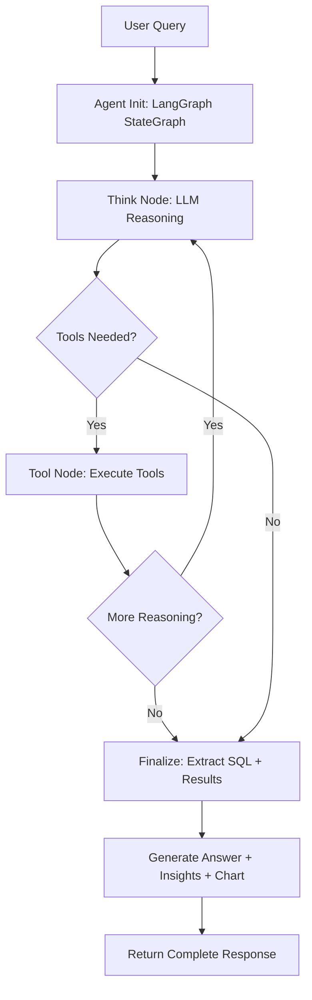

# Agent Reference

The ReAct agent is nl2sql-app's reasoning engine for complex, multi-step data analysis. It uses a tool-calling loop to plan, execute SQL, interpret results, and refine its approach.

## Contents

- [Overview](#overview)
- [API Reference](#api-reference)
- [Configuration](#configuration)
- [Workflows](#workflows)
- [Troubleshooting](#troubleshooting)

---

## Overview

nl2sql-app provides two query modes through a single unified endpoint (`POST /api/v1/chat`):

- **Standard mode** generates SQL in a single LLM call. It is fast (1-3 seconds), cost-effective, and suited for straightforward queries where you already know what data you need.
- **Analyst mode** uses a ReAct (Reason + Act) agent that iteratively calls tools, executes SQL, detects insights, assesses data quality, and recommends charts. It is slower (5-15 seconds) but delivers a complete analytical response.

The agent is built on LangGraph's `StateGraph` with LiteLLM for provider-agnostic LLM calls and a custom `ToolRegistry` for tool execution. On each iteration, the LLM decides which tools to call, receives their results, and either continues reasoning or finalizes an answer. A maximum of 10 iterations prevents runaway loops, and configurable timeouts cap total execution time.

Both modes support multi-turn conversations with automatic follow-up detection, Server-Sent Events (SSE) streaming for real-time progress, and session-based state persistence. Context Studio business terms and column descriptions are injected into prompts when available, improving SQL accuracy for domain-specific terminology.

### When to use each mode

| Scenario | Recommended mode |
|----------|-----------------|
| Quick SQL for a known query | Standard |
| Exploratory analysis of unfamiliar data | Analyst |
| Dashboard queries where speed matters | Standard |
| Business questions needing insights and charts | Analyst |
| Cost-sensitive batch workloads | Standard |
| Data quality assessment | Analyst |

---

## API Reference

### POST /api/v1/chat

The primary endpoint for all query interactions. Requires a valid session with a connected database.

**Headers:**

```http
Content-Type: application/json
X-CSRF-Token: <csrf_token>
```

### Request

```json
{
  "session_id": "abc123",
  "message": "Show top 10 customers by revenue",
  "mode": "analyst",
  "stream": false,
  "include_reasoning": false,
  "include_chart": true,
  "continue_conversation": true
}
```

| Field | Type | Required | Default | Description |
|-------|------|----------|---------|-------------|
| `session_id` | string | Yes | -- | Active session ID |
| `message` | string | Yes | -- | Natural language question (3-5000 chars) |
| `mode` | string | No | `"standard"` | `"standard"` or `"analyst"` |
| `stream` | boolean | No | `false` | Enable SSE streaming |
| `include_reasoning` | boolean | No | `false` | Include reasoning trace (analyst) |
| `include_chart` | boolean | No | `true` | Auto-generate chart spec (analyst) |
| `continue_conversation` | boolean | No | `true` | Continue from previous context; `false` resets |

### Response (non-streaming)

```json
{
  "success": true,
  "mode": "analyst",
  "sql": "SELECT customer_id, SUM(revenue) as total_revenue FROM orders GROUP BY customer_id ORDER BY total_revenue DESC LIMIT 10",
  "is_valid": true,
  "query_type": "SELECT",
  "query_id": "a1b2c3d4",
  "sql_hash": "hmac_abc123...",
  "answer": "Your top 10 customers generated $2.3M in revenue.",
  "key_findings": [
    "Top 3 customers represent 40% of total revenue",
    "Customer #123 ($450K) is 3x larger than #2"
  ],
  "confidence": 0.92,
  "chart": {
    "chart_type": "bar",
    "title": "Top 10 Customers by Revenue",
    "x_axis": "customer_id",
    "y_axis": "total_revenue"
  },
  "raw_result": {
    "row_count": 10,
    "columns": ["customer_id", "total_revenue"],
    "sample_rows": [],
    "has_more": false
  },
  "data_quality": {
    "overall_score": 95,
    "completeness": 100,
    "issues": []
  },
  "tools_used": ["search_tables", "get_table_schema", "execute_and_analyze"],
  "tool_calls_count": 3,
  "execution_time_ms": 2340,
  "usage": {
    "prompt_tokens": 1250,
    "completion_tokens": 450,
    "total_tokens": 1700,
    "cost_usd": 0.034,
    "calls": 2
  },
  "is_follow_up": false,
  "conversation_turn": 1,
  "suggestions": ["Break this down by region", "Show trend over time"],
  "error": null,
  "warnings": []
}
```

**Key response fields:**

- **SQL fields:** `sql`, `is_valid`, `query_type`, `query_id`, `sql_hash` (HMAC integrity hash)
- **Analyst-only fields:** `answer`, `key_findings`, `confidence` (0-1), `chart`, `raw_result`, `data_quality`, `suggestions`, `reasoning`
- **Metadata:** `tools_used`, `tool_calls_count`, `execution_time_ms`, `usage`, `is_follow_up`, `conversation_turn`

### Streaming (SSE)

Set `stream: true` to receive real-time progress events. Each event is a `data:` line containing JSON.

**Standard mode flow:**

```
thinking -> sql_chunk -> sql_chunk -> ... -> sql_complete -> done
```

**Analyst mode flow:**

```
thinking -> tool_call -> tool_result -> ... -> sql -> executing -> analyzing -> done
```

**Event types:**

| Event | Description | Key fields |
|-------|-------------|------------|
| `thinking` | Agent is processing | `content`, `progress` |
| `sql_chunk` | SQL token (standard only) | `content` |
| `sql_complete` | Final SQL (standard only) | `content` |
| `sql` | Generated SQL (analyst only) | `content` |
| `tool_call` | Tool invocation | `tool_name`, `tool_args`, `step_number` |
| `tool_result` | Tool output | `tool_name`, `content`, `summary` |
| `executing` | Running SQL query | `content` |
| `analyzing` | Generating insights (analyst) | `content` |
| `done` | Complete response | `data` (full response payload) |
| `error` | Error occurred | `content` (error message) |

### Error responses

| HTTP Code | Cause | Resolution |
|-----------|-------|------------|
| 400 | Message too short/long | Check message length (3-5000 chars) |
| 404 | Session not found | Create a new session via `/api/v1/session/create` |
| 429 | Rate limit exceeded | Wait and retry with backoff |
| 500 | Agent timeout | Simplify query or increase `AGENT_TIMEOUT_SECONDS` |
| 500 | LLM provider error | Check API key and model availability |
| 500 | Database connection failed | Verify database connectivity |

### Multi-turn conversations

Conversations are continued by default (`continue_conversation: true`). The endpoint auto-detects follow-ups using pattern matching on references like "break that down", "what about", and "the same but for". The last 5 conversation turns are preserved as context.

To start a fresh conversation, send `continue_conversation: false`. The response includes `is_follow_up` and `conversation_turn` fields so clients can track state.

---

## Configuration

All configuration is managed through environment variables, typically set in `.env` files.

### Core agent settings

| Variable | Type | Default | Description |
|----------|------|---------|-------------|
| `AGENT_TIMEOUT_SECONDS` | int | `120` | Max execution time for agent workflow |
| `AGENT_MAX_RETRIES` | int | `3` | Self-healing retry attempts on tool failure |
| `AGENT_QUERY_LIMIT_DEFAULT` | int | `5000` | Default row limit for `execute_and_analyze` |
| `AGENT_QUERY_LIMIT_MAX` | int | `20000` | Hard cap on row limit (prevents OOM) |
| `AGENT_MAX_MESSAGES` | int | `50` | Max messages in history before truncation |
| `AGENT_PRESERVE_RECENT` | int | `20` | Recent messages always preserved during truncation |
| `AGENT_MAX_TOOL_OUTPUT` | int | `4000` | Max characters per tool output |
| `AGENT_STREAM_TOOL_OUTPUT` | int | `500` | Max characters for streaming tool output |
| `AGENT_USE_POSTGRES_STATE` | bool | `true` | Use PostgreSQL for state persistence (enables scaling) |

### LLM provider settings

| Variable | Type | Default | Description |
|----------|------|---------|-------------|
| `DEFAULT_LLM_PROVIDER` | string | `oauth_gateway` | Provider: `oauth_gateway`, `openai`, `anthropic`, `azure`, `custom` |
| `DEFAULT_LLM_MODEL` | string | `gpt-4` | Model name |
| `DEFAULT_LLM_API_KEY` | string | -- | API key (use secret manager in production) |

### Caching

| Variable | Type | Default | Description |
|----------|------|---------|-------------|
| `CACHE_TYPE` | string | `auto` | `auto` (Redis if available), `redis`, or `memory` |
| `CACHE_TTL_LLM` | int | `3600` | LLM response cache TTL in seconds |
| `CACHE_TTL_QUERY` | int | `300` | Query result cache TTL |
| `CACHE_TTL_SCHEMA` | int | `3600` | Schema metadata cache TTL |
| `REDIS_URL` | string | `redis://localhost:6379` | Redis connection URL |

### Rate limiting

| Variable | Type | Default | Description |
|----------|------|---------|-------------|
| `RATE_LIMIT_ENABLED` | bool | `true` | Enable rate limiting |
| `RATE_LIMIT_LLM` | string | `30/minute` | Rate limit for LLM API calls |
| `RATE_LIMIT_QUERY` | string | `60/minute` | Rate limit for query execution |

### Session and history

| Variable | Type | Default | Description |
|----------|------|---------|-------------|
| `SESSION_EXPIRY_HOURS` | int | `24` | Session lifetime |
| `MAX_CONTEXT_WINDOW` | int | `20` | Max conversation turns retained |
| `MAX_HISTORY_ITEMS` | int | `100` | Max query history items per session |
| `QUERY_HISTORY_RETENTION_DAYS` | int | `30` | Days to keep queries in PostgreSQL |
| `DATABASE_URL` | string | -- | PostgreSQL URL for state and history |

### Application

| Variable | Type | Default | Description |
|----------|------|---------|-------------|
| `LOG_LEVEL` | string | `INFO` | `DEBUG`, `INFO`, `WARNING`, `ERROR` |
| `LOG_FORMAT` | string | `text` | `text` (development) or `json` (production) |
| `WORKERS` | int | `4` | Uvicorn worker count. Formula: `(2 x CPU cores) + 1` |

### Tuning profiles

**Low latency (speed priority):**

```bash
AGENT_TIMEOUT_SECONDS=60
AGENT_QUERY_LIMIT_DEFAULT=1000
AGENT_MAX_RETRIES=1
CACHE_TTL_LLM=7200
DEFAULT_LLM_MODEL=gpt-3.5-turbo
WORKERS=8
```

**High accuracy (quality priority):**

```bash
AGENT_TIMEOUT_SECONDS=180
AGENT_QUERY_LIMIT_DEFAULT=20000
AGENT_MAX_RETRIES=5
CACHE_TTL_LLM=1800
DEFAULT_LLM_MODEL=gpt-4-turbo-preview
WORKERS=4
```

**Cost optimization (budget priority):**

```bash
AGENT_QUERY_LIMIT_DEFAULT=5000
AGENT_MAX_RETRIES=2
CACHE_TTL_LLM=86400
DEFAULT_LLM_MODEL=gpt-3.5-turbo
RATE_LIMIT_LLM=20/minute
```

### Scaling

For single-instance deployments (development, small teams), set `CACHE_TYPE=memory` and `AGENT_USE_POSTGRES_STATE=false`. No external dependencies required, but state is lost on restart.

For multi-instance deployments (production), you need:

- **PostgreSQL** for shared state (`DATABASE_URL` + `AGENT_USE_POSTGRES_STATE=true`)
- **Redis** for distributed cache and locking (`REDIS_URL` + `CACHE_TYPE=redis`)
- A load balancer with session affinity recommended

---

## Workflows

### Standard mode flow

1. **Request received** at `POST /api/v1/chat` with `mode: "standard"`
2. **Context loaded** -- session config, conversation history (last 5 turns), follow-up detection
3. **Schema retrieved** via semantic vector search for relevant tables
4. **SQL generated** in a single LLM call with schema context injected into the prompt
5. **SQL validated** -- AST parsing, read-only check (SELECT/WITH only), injection pattern detection, HMAC hash registered
6. **Response returned** with SQL, query ID, and metadata

Performance: 1-3 seconds, ~500-1000 tokens, single LLM call.

### Analyst mode flow



1. **Agent initialized** with LangGraph `StateGraph`, LiteLLM tool binding, and conversation context
2. **Think node** (iterations 1-10): LLM receives the question, tool descriptions, conversation history, and prior tool results. It decides which tools to call next.
3. **Tool node**: Tools execute in sequence. Common patterns:
   - `search_tables` to find relevant schema
   - `get_table_schema` for column details
   - `lookup_business_term` to resolve domain terminology
   - `execute_and_analyze` to run SQL and get insights in one step
   - `recommend_chart` for visualization selection
4. **Loop prevention**: Max 10 iterations, consecutive no-progress detection, configurable timeout
5. **Finalize**: SQL extracted from agent messages, validated, HMAC hash registered
6. **Answer generation**: If `execute_and_analyze` was used, pre-computed insights are returned directly. Otherwise, `AnswerGenerator` makes an additional LLM call for key findings and chart recommendations.

Performance: 5-15 seconds, ~3000-5000 tokens, 3-10 LLM calls.

### Available tools

**Query tools (6):**

| Tool | Purpose |
|------|---------|
| `search_tables` | Semantic search for relevant tables |
| `get_table_schema` | Column types, constraints, keys |
| `get_sample_data` | Preview actual data rows |
| `find_similar_queries` | Learn from query history |
| `lookup_business_term` | Resolve Context Studio business terms |
| `execute_sql` | Run SQL and return results |

**Analysis tools (8):**

| Tool | Purpose |
|------|---------|
| `execute_and_analyze` | Execute SQL + run full analysis pipeline |
| `detect_insights` | Pattern detection (concentration, trends, anomalies) |
| `analyze_statistics` | Advanced statistical analysis |
| `check_data_quality` | Quality scoring (0-100) with issue detection |
| `compare_periods` | Temporal comparisons (QoQ, YoY) |
| `suggest_followups` | Generate follow-up question suggestions |
| `recommend_chart` | Select best chart type for the data |
| `prepare_chart_data` | Transform data for chart rendering |

### Multi-turn conversation pattern

```
Turn 1: "Analyze Q4 2025 sales performance"
  -> Agent generates SQL, runs analysis, returns insights + chart

Turn 2: "Compare to Q3"  (auto-detected as follow-up)
  -> Agent uses prior context, modifies SQL for Q3 comparison

Turn 3: "What about by region?"  (auto-detected as follow-up)
  -> Agent adds regional breakdown, runs segment comparison
```

The last 5 turns are preserved. Older turns are auto-pruned. Send `continue_conversation: false` to start fresh.

---

## Troubleshooting

### Agent execution timed out

**Symptoms:** `Agent execution timed out after 120 seconds`

**Causes:** Complex query with too many tool calls, large dataset (>20K rows), slow database, slow LLM provider, or agent stuck in a reasoning loop.

**Fixes:**
- Increase timeout: `AGENT_TIMEOUT_SECONDS=180`
- Reduce row limit: `AGENT_QUERY_LIMIT_DEFAULT=5000`
- Use a faster model: `DEFAULT_LLM_MODEL=gpt-3.5-turbo`
- Add database indexes on frequently queried columns

### Agent stuck in loop

**Symptoms:** Same tool called repeatedly, max iterations (10) reached without completing.

**Causes:** Unclear tool error messages, missing schema information, ambiguous user question.

**Fixes:**
- Loop detection is built in -- the agent stops after 2 consecutive iterations with no progress
- Check debug logs: `LOG_LEVEL=DEBUG` and look for repeated tool call patterns
- Ensure `search_tables` is called before `execute_sql` so the agent has schema context
- Provide more specific questions to reduce ambiguity

### Table does not exist

**Symptoms:** `Tool 'execute_sql' failed: Table does not exist`

**Causes:** Missing schema qualification (e.g., `orders` instead of `demoapp.orders`), permission errors, stale schema cache.

**Fixes:**
- The agent should use `search_tables` first to discover the correct fully-qualified name
- Verify database permissions: `SHOW GRANTS FOR 'user'@'host'`
- Clear schema cache by restarting or waiting for `CACHE_TTL_SCHEMA` to expire

### SSE streaming drops

**Symptoms:** Connection drops mid-stream, events arrive out of order, browser shows connection failure.

**Causes:** Reverse proxy buffering, network timeout, server-side exception.

**Fixes:**
- Disable proxy buffering in Nginx: `proxy_buffering off;` on the `/api/v1/chat` location
- The backend already sets `X-Accel-Buffering: no` and `Cache-Control: no-cache` headers
- Implement client-side reconnection with exponential backoff (max 3 retries)

### Missing insights (empty key_findings)

**Symptoms:** `key_findings: []`, low confidence score, no patterns detected despite clear data.

**Causes:** Insufficient data (< 5 rows), agent used `execute_sql` instead of `execute_and_analyze`, data too uniform for pattern detection.

**Fixes:**
- Ensure the agent calls `execute_and_analyze` rather than plain `execute_sql` for analyst mode
- Minimum data requirements: 5 rows for concentration, 3 for trends, 10 for anomalies
- Check `tools_used` in the response to confirm which tools ran

### Lost conversation context

**Symptoms:** Follow-up treated as new query (`is_follow_up: false`), agent does not remember previous results.

**Causes:** Session expired, cache cleared, `continue_conversation: false` was sent, or multi-instance deployment without shared state.

**Fixes:**
- Check session validity and expiry (`SESSION_EXPIRY_HOURS`)
- For multi-instance deployments, enable `AGENT_USE_POSTGRES_STATE=true` with a shared `DATABASE_URL`
- Verify `continue_conversation` is not being set to `false` unintentionally

### Rate limit exceeded

**Symptoms:** HTTP 429 or `Rate limit exceeded` in response.

**Causes:** Too many requests to LLM provider or database in a short window.

**Fixes:**
- Enable aggressive caching: `CACHE_TTL_LLM=7200`
- Lower the application rate limit: `RATE_LIMIT_LLM=10/minute`
- Switch to a cheaper/faster model to reduce per-request cost
- Implement client-side exponential backoff

### High memory usage / OOM

**Symptoms:** OOM kills, high swap usage, server unresponsive.

**Causes:** Large query results loaded into memory, too many workers, verbose tool output.

**Fixes:**
- Reduce query limits: `AGENT_QUERY_LIMIT_DEFAULT=5000`, `AGENT_QUERY_LIMIT_MAX=10000`
- Reduce workers: `WORKERS=4`
- Truncate tool output: `AGENT_MAX_TOOL_OUTPUT=2000`
- Enable aggressive message truncation: `AGENT_MAX_MESSAGES=30`

Memory rule of thumb: ~650MB per worker. Total = `650MB x WORKERS + Redis (500MB) + overhead (500MB)`.

### No SQL generated

**Symptoms:** Agent completes but response contains no SQL.

**Causes:** Question not answerable with SQL, tools unavailable, or agent provided a text explanation instead.

**Fixes:**
- Check if the question is actually a SQL-answerable data question
- In streaming mode, the agent may return an `is_agent_message: true` response with an explanation rather than SQL -- this is intentional for non-data questions
- Enable debug logging to trace the agent's reasoning

### Debug logging

Enable detailed agent tracing for any issue:

```bash
LOG_LEVEL=DEBUG
LOG_FORMAT=text
```

Key log patterns to watch for:

```
[DEBUG] Agent starting: question="..."
[DEBUG] Tool call: search_tables(query="...")
[DEBUG] Tool result: Found 3 tables
[ERROR] Tool execution failed: tool=execute_sql, error=...
[DEBUG] Error classified: type=TABLE_NOT_FOUND, retryable=True
[DEBUG] Agent complete: success=True, tools_used=3
```

For production, use `LOG_FORMAT=json` and ship structured logs to your aggregator (CloudWatch, Datadog, ELK, Splunk).
