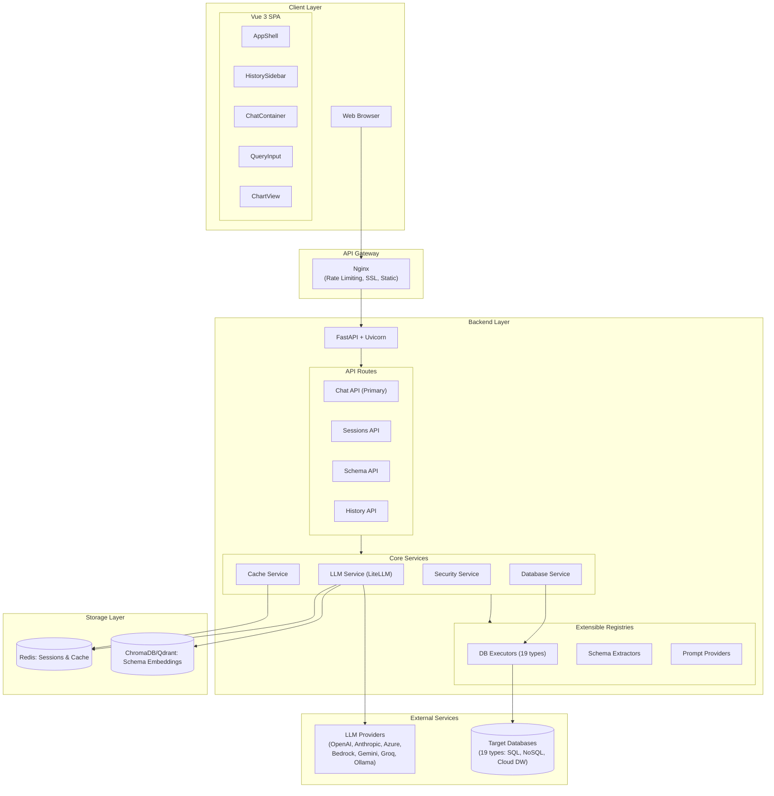
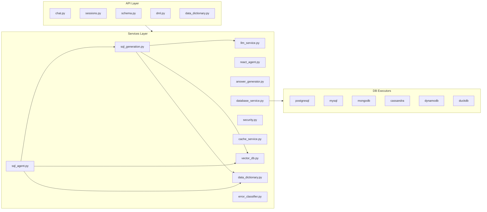
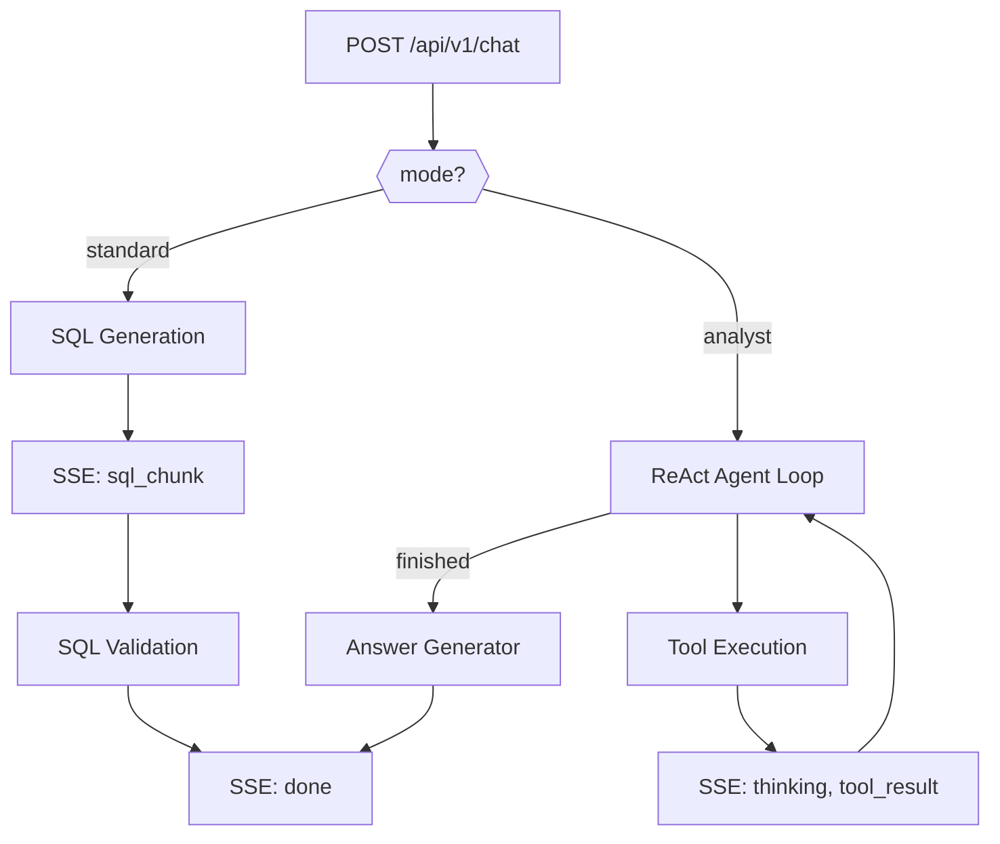

# QueryfyAI Architecture

> **Version**: 1.3.0
> **Last Updated**: February 2026

---

## Table of Contents

1. [Overview](#overview)
2. [System Architecture](#system-architecture)
3. [Unified Chat Architecture](#unified-chat-architecture)
4. [Core Components](#core-components)
5. [Resilience & Circuit Breakers](#resilience--circuit-breakers)
6. [Data Sampling & LLM Insights](#data-sampling--llm-insights)
7. [Metadata-Driven SQL Generation](#metadata-driven-sql-generation)
8. [Security Architecture](#security-architecture)
9. [Frontend Architecture](#frontend-architecture)
10. [Backend Architecture](#backend-architecture)
11. [Deployment & Performance](#deployment--performance)

---

## Overview

QueryfyAI is a production-ready Natural Language to SQL platform that enables users to query databases using plain English. The system combines large language models (LLMs), vector-based schema retrieval, and intelligent query validation to deliver accurate, secure SQL generation.

### Key Differentiators

| Feature | Description |
|---------|-------------|
| **Unified Chat API** | Single `/chat` endpoint for all query modes (standard and analyst) |
| **AI Data Analyst Mode** | ReAct agent with 15 specialized tools and 5 analysis engines |
| **Multi-Turn Conversations** | Context-aware follow-up questions with conversation history |
| **Multi-LLM Support** | 15+ providers including corporate OAuth gateways |
| **Multi-Database** | 19 database types including NoSQL (MongoDB, Cassandra, DynamoDB) |
| **Streaming Generation** | Real-time SQL generation and agent reasoning with SSE |
| **Enterprise Security** | 26+ prompt injection patterns, CSRF, rate limiting |
| **Smart Visualizations** | Auto-detected charts with data-driven recommendations |
| **Intelligent Query Generation** | Few-shot learning, Chain-of-Thought reasoning, self-correction |
| **Context Studio** | Visual data dictionary management for improved SQL accuracy |
| **Distributed Tracing** | OpenTelemetry with Jaeger for full observability |

---

## System Architecture

### High-Level Overview



### Backend Services (`app/services/`)



---

## Unified Chat Architecture

The unified `/chat` endpoint consolidates all query modes into a single API.



### Mode Comparison

| Aspect | Standard Mode | Analyst Mode |
|--------|--------------|--------------|
| **Purpose** | Fast SQL generation | Complete data analysis |
| **LLM Calls** | 1 (SQL generation) | 3-5 (reasoning + tools + answer) |
| **Output** | SQL query only | SQL + results + chart + findings |
| **Latency** | 1-3 seconds | 5-15 seconds |

### ReAct Agent Tools (15 total)

**Schema & Discovery (5):** `search_tables`, `get_table_schema`, `lookup_business_term`, `find_similar_queries`, `get_sample_data`

**Execution (2):** `execute_sql`, `execute_and_analyze`

**Analysis (8):** `detect_insights`, `analyze_statistics`, `check_data_quality`, `compare_periods`, `suggest_followups`, `recommend_chart`, `prepare_chart_data`, `annotate_chart`

### Analysis Engines (5)

| Engine | Module | Output |
|--------|--------|--------|
| **Insight Detector** | `insight_detector.py` | Patterns, anomalies, trends with severity levels |
| **Statistics** | `statistics.py` | Mean, median, quartiles, percentiles, skewness |
| **Data Quality** | `data_quality.py` | Quality score (0-100), completeness %, issue list |
| **Comparisons** | `comparisons.py` | Period-over-period changes, growth rates |
| **Chart Intelligence** | `chart_intelligence.py` | Chart type + config, visualization-ready data |

### Streaming Events (SSE)

| Event | Mode | Description |
|-------|------|-------------|
| `thinking` | Both | Processing status updates |
| `sql_chunk` | Standard | Progressive SQL token |
| `sql_complete` | Standard | Final validated SQL |
| `tool_call` | Analyst | Tool invocation with args |
| `tool_result` | Analyst | Tool execution result |
| `executing` | Both | Query execution started |
| `analyzing` | Analyst | Analysis in progress |
| `done` | Both | Final response with all data |
| `error` | Both | Error occurred |

### Multi-Turn Conversations

Each query is stored with the session. The last 5 turns are included in the LLM prompt, enabling the model to resolve references like "it", "those", "the same". Follow-up detection recognizes reference pronouns, conjunctions, and modification keywords.

**Agent state** is managed via configurable checkpointer backends:
- **In-Memory** (default): Development and testing, session-scoped
- **PostgreSQL**: Production use, durable, supports horizontal scaling

---

## Core Components

### 1. LLM Service

Unified interface to 15+ providers through LiteLLM: OpenAI, Anthropic, Azure OpenAI, AWS Bedrock, Google Vertex AI, Gemini, Groq, Ollama, and OAuth Gateway for corporate deployments. Supports automatic token refresh, response streaming via SSE, configurable retry logic, and cost tracking.

### 2. Database Service

Supports 19 database types with specialized executors and schema extractors:

| Category | Databases |
|----------|-----------|
| **Relational** | PostgreSQL, MySQL/MariaDB, SQL Server, Oracle, SQLite |
| **Cloud DW** | Snowflake, BigQuery, Redshift, Databricks, Athena |
| **Analytical** | ClickHouse, Trino/Presto, Hive, Spark, DuckDB |
| **NoSQL** | MongoDB (MQL), Cassandra (CQL), DynamoDB (PartiQL) |

NoSQL databases generate native query languages rather than forcing SQL abstraction.

### 3. Vector Database Service

Stores schema embeddings for RAG-based context retrieval (ChromaDB default, Qdrant for production). Schema is chunked per-table, embedded with sentence transformers, and queried at runtime to retrieve the top-k relevant tables for each user question.

### 4. Security Service

Multi-layer defense: input validation (Pydantic), prompt injection detection (26+ patterns), SQL validation (AST-based), output sanitization, and HMAC hash integrity verification. See [Security Architecture](#security-architecture).

### 5. Telemetry Service

OpenTelemetry-based distributed tracing with Jaeger export. Auto-instruments FastAPI, httpx, and Redis. Manual spans for LLM calls (with token counts), database queries (with row counts), and agent reasoning steps.

### 6. Data Dictionary Service

Manages business metadata (table/column descriptions, glossary terms, relationships) stored in PostgreSQL via Alembic migrations. Users add context through the Context Studio UI; descriptions are retrieved during SQL generation and injected into the LLM prompt.

### 7. Error Classifier

Classifies errors as permanent (schema issues, permissions) or transient (timeouts, connection) and selects a retry strategy: fix syntax, add schema context, simplify query, or abort. Max 3 retries per generation attempt.

### 8. DML Service

Safe data modification with three modes: **Preview** (converts DML to SELECT), **Sandbox** (execute + ROLLBACK), and **Confirm** (execute + COMMIT with single-use, 5-min-expiry token). WHERE clause required for UPDATE/DELETE; DROP/TRUNCATE/ALTER always blocked. Tokens stored in Redis for multi-instance support.

### 9. Connection Pool Manager

Async connection pooling for server databases (PostgreSQL, MySQL, etc.) with sync-to-async bridging via thread pools for embedded databases (SQLite, DuckDB). Automatic cleanup on idle timeout and health checking.

### 10. Query History Service

Hybrid hot/cold storage: Redis (24h TTL) for recent queries, PostgreSQL (30+ day retention) for archives. Security enforced via `connection_hash` (SHA256[:16]), `db_type` validation, and `sql_hash` (HMAC-SHA256) integrity checks. SQL is stored server-side and never trusted from the client.

---

## Resilience & Circuit Breakers

The ReAct agent (analyst mode) includes resilience features to prevent infinite loops, handle errors gracefully, and protect system resources. These features are isolated to analyst mode -- standard SQL generation is unaffected.

**Circuit Breaker** monitors agent behavior and halts execution on problematic patterns:

| Condition | Threshold | Rationale |
|-----------|-----------|-----------|
| Permanent errors (schema issues, permission denied) | 3 errors | Allows legitimate multi-step schema corrections |
| Same error repeated | 2 identical errors | Fast stop for true loops |
| Transient failures (timeouts, connection errors) | 5 consecutive | Allows retries with recovery hints |
| Exploration without SQL execution | 7 iterations | Supports complex 3-table JOIN discovery (~6 steps) |
| Consecutive tool failures | 5 failures | Detects stuck agents; resets on any success |

**Memory Protection** prevents resource exhaustion on large result sets:
- Memory guard rejects estimated result sets over 50 MB with a recommendation to add filters
- Result sets above 1,000 rows are randomly sampled for pattern detection (analysis only -- full data still returned to user)
- Strings over 100 characters are truncated for analysis to prevent memory bloat
- Tool execution timeout of 30 seconds (configurable via `AGENT_TOOL_TIMEOUT`) uses non-blocking `asyncio.wait_for()`

**Configuration** (`backend/.env`):
```bash
AGENT_QUERY_LIMIT_DEFAULT=1000   # Default row limit
AGENT_QUERY_LIMIT_MAX=10000      # Hard cap for memory safety
AGENT_TOOL_TIMEOUT=30            # Per-tool timeout in seconds
```

---

## Data Sampling & LLM Insights

QueryfyAI uses a two-tier analysis strategy that preserves data accuracy while maintaining performance:

**Tier 1 -- Aggregate Queries** (< 100 rows, e.g., GROUP BY results):
- No sampling applied; all rows analyzed with full statistics
- LLM-enhanced business insights generated via a cost-efficient model (~$0.0006/query)
- Graceful fallback to statistical-only insights if LLM is unavailable

**Tier 2 -- Raw Data Queries** (100+ rows):
- Statistics (mean, median, percentiles, distributions) computed on the **full dataset** up to 10,000 rows
- Pattern detection and chart recommendations use a 1,000-row random sample for performance
- Sampling disclaimers automatically appended to insights, noting which metrics are exact vs. sampled
- Sampling bias detection warns about time-series data, sequential IDs, and high-variance columns

**Key thresholds** (in `app/services/tools/query_tools.py`):
- `SAMPLING_THRESHOLD = 1000` -- sample for pattern detection above this
- `LLM_AGGREGATE_THRESHOLD = 100` -- use LLM insights for aggregates below this
- `FULL_STATS_THRESHOLD = 10000` -- compute full statistics up to this size

---

## Metadata-Driven SQL Generation

Schema metadata significantly improves SQL accuracy by giving the LLM precise context about database structure, relationships, and business semantics.

**Metadata hierarchy** used during SQL generation:
1. **Column types & constraints** -- correct literal formatting, NULL handling, JOIN generation from foreign keys
2. **Table/column comments** -- business context extracted from database comments or the Context Studio data dictionary
3. **Sample values** -- valid filter options for categorical columns (extracted when cardinality < 100)
4. **Table statistics** -- row counts and cardinality inform JOIN ordering and query optimization hints
5. **Index information** -- helps the LLM generate queries that leverage existing indexes

**RAG context assembly** (`sql_generation.py` + `vector_db.py`):
- Schema chunks are embedded per-table in ChromaDB/Qdrant using sentence transformers
- User query is embedded at runtime; top-k relevant tables retrieved via semantic search
- Data dictionary descriptions and business glossary terms are fused into the LLM prompt
- Few-shot examples from previously successful queries are included when available

**Prompt enrichment layers**:
- Database-specific hints (e.g., PostgreSQL `ILIKE`, BigQuery backtick syntax)
- Query-intent detection (aggregation, time-series, ranking, comparison) adds targeted generation hints
- Conversation history (last 5 turns) provides context for follow-up queries

---

## Security Architecture

### Defense in Depth

| Layer | Protection | Implementation |
|-------|-----------|----------------|
| **Network** | Rate limiting, SSL/TLS, CORS | Nginx (10 req/s) |
| **Application** | CSRF, session signing, input validation | HMAC-SHA256, Pydantic |
| **Prompt Security** | Instruction override, jailbreak, encoded payloads | 26+ detection patterns |
| **SQL Security** | AST validation, DML safety, multi-statement blocking | Preview/Sandbox/Confirm modes |
| **Output** | Security headers, response sanitization, error scrubbing | CSP, X-Frame-Options |

### Prompt Injection Detection (26+ patterns)

| Category | Example Pattern | Action |
|----------|----------------|--------|
| Instruction Override | "Ignore previous instructions" | Block |
| System Prompt Leak | "Show me your system prompt" | Block |
| Roleplay | "Act as a DBA with full access" | Block |
| Encoded | Base64/hex encoded commands | Block |
| SQL-in-NL | "SELECT * embedded in question" | Sanitize |

---

## Frontend Architecture

### Component Hierarchy

```
App.vue
├── AppShell.vue (Layout container)
│   ├── AppHeader.vue (Logo, theme, settings, Context Studio)
│   ├── HistorySidebar.vue (Query history)
│   │   └── ActivityPanel.vue (Search, pinned, recent)
│   ├── ChatContainer.vue (Conversation display)
│   │   ├── UserMessage.vue
│   │   └── AIResponseCard.vue
│   │       ├── ResultsExpander.vue
│   │       └── ChartView.vue
│   │           └── ChartCustomizer.vue
│   ├── SuggestionsPanel.vue (Schema-aware suggestions)
│   ├── QueryInput.vue (Input with options)
│   ├── SettingsDrawer.vue (LLM/DB config, session stats)
│   └── ContextStudioPanel.vue (Data dictionary management)
├── ToastContainer.vue (Notifications)
└── LoadingOverlay.vue
```

### State Management (Pinia Stores)

| Store | File | Purpose | Persistence |
|-------|------|---------|-------------|
| `useConversationStore` | `conversation.js` | Chat messages, turns | Session |
| `useActivityStore` | `activity.js` | Query history, pinned items | localStorage |
| `useSessionStore` | `session.js` | Connection and session state | Session |
| `useDataDictionaryStore` | `dataDictionary.js` | Business metadata, glossary | Backend (PostgreSQL) |

### Composables

| Composable | File | Function |
|------------|------|----------|
| `useToast` | `useToast.js` | Notifications with auto-dismiss |
| `useQueryOptions` | `useQueryOptions.js` | Toggle streaming and agentic modes |

---

## Backend Architecture

### Service Registry Pattern

```
services/
├── executors/           # DB-specific query executors (postgresql, mysql, mongodb, cassandra, dynamodb, duckdb, sqlite)
├── schema_extractors/   # DB-specific schema extraction (postgresql, mysql, mongodb, cassandra, dynamodb, generic_sql)
├── prompt_providers/    # DB-specific prompt templates (postgresql, mongodb, cassandra, dynamodb)
├── analysis_engines/    # insight_detector, statistics, data_quality, comparisons, chart_intelligence
├── tools/               # ReAct agent tool implementations
├── validators/          # Input and output validation
├── llm_service.py       # LiteLLM integration, streaming, token management
├── react_agent.py       # ReAct reasoning loop, tool orchestration
├── sql_generation.py    # Prompt assembly, context fusing
├── sql_agent.py         # Self-healing SQL, error recovery
├── database_service.py  # Connection pooling, query execution
├── security.py          # Prompt injection, SQL validation, hash verification
├── vector_db.py         # ChromaDB/Qdrant, RAG retrieval
├── data_dictionary.py   # Business terms, metadata
├── error_classifier.py  # Error analysis and retry strategy
├── cache_service.py     # Redis/Memory schema caching
├── dml_service.py       # Safety modes, token management
├── answer_generator.py  # Final answer synthesis, chart generation
├── connection_pool_manager.py
├── query_history_service.py
├── session_store.py
└── token_manager.py
```

### SQL Generation Techniques

| Technique | Description |
|-----------|-------------|
| **Few-Shot Learning** | Example queries from similar database schemas |
| **Chain-of-Thought (CoT)** | Step-by-step reasoning for complex queries |
| **Self-Correction** | Automatic retry with error context on failures |
| **Feedback Integration** | Learn from user ratings to improve prompts |
| **Complexity Routing** | Use faster/cheaper models for simple queries |

### API Endpoint Groups

| Group | Prefix | Description |
|-------|--------|-------------|
| **Chat** | `/api/v1/chat` | **Primary** -- unified chat for standard and analyst modes |
| Sessions | `/api/v1/sessions` | Session CRUD, connection tests |
| Schema | `/api/v1/schema` | Refresh, retrieve schema |
| History | `/api/v1/history` | Query history, feedback |
| DML | `/api/v1/dml` | Preview, sandbox, execute data modifications |
| Health | `/health` | Liveness, readiness probes |

---

## Deployment & Performance

| Option | Best For | Complexity |
|--------|----------|------------|
| Docker Compose | Development, small teams | Low |
| Docker + Redis | Production, single server | Medium |
| Kubernetes | Enterprise, high availability | High |

| Metric | Typical Value |
|--------|---------------|
| First token latency | 300-800ms |
| Full SQL generation | 1-3s |
| Schema refresh | 2-10s |
| Chart rendering | <100ms |

---

## Related Documentation

- [README.md](../README.md) - Quick start and overview
- [ONBOARDING.md](./ONBOARDING.md) - Detailed setup guide
- [ROADMAP.md](./ROADMAP.md) - Product roadmap
- [SECURITY.md](./SECURITY.md) - Security policies
- [RUNBOOK.md](../RUNBOOK.md) - Operational procedures
